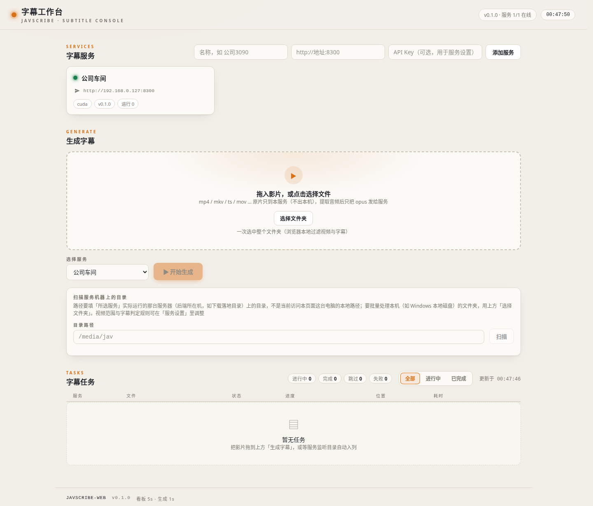

# JavScribe

**JAV 字幕生成与媒体库联动** — 功能层开源项目。ja→zh ASR 翻译 + `.zh.srt` 原位落位 + 下载目录监听 + 进度查询 + 远端处理。

> **本仓库只做「功能」，不内置任何模型权重。** 需要什么模型、去哪下、放哪、怎么配，见 [docs/models.md](docs/models.md)；部署方式（本地 / Docker）见 [docs/deployment.md](docs/deployment.md) 与 [docs/docker.md](docs/docker.md)。

## 最新版下载

<!-- release-latest:client -->
🖥️ **JavScribe Client**（桌面客户端）v0.2.2：[Windows 安装包](https://github.com/JavdBviewed/JavScribe/releases/download/client-v0.2.2/JavScribe.Client.Setup.0.2.2.exe) · [Windows 便携版](https://github.com/JavdBviewed/JavScribe/releases/download/client-v0.2.2/JavScribe.Client.0.2.2.exe) · [Linux AppImage](https://github.com/JavdBviewed/JavScribe/releases/download/client-v0.2.2/JavScribe.Client-0.2.2.AppImage) · [Linux deb](https://github.com/JavdBviewed/JavScribe/releases/download/client-v0.2.2/jav-scribe-client_0.2.2_amd64.deb) · [全部资产](https://github.com/JavdBviewed/JavScribe/releases/tag/client-v0.2.2)

<!-- release-latest:serve -->
⚙️ **JavScribe Serve**（headless 服务端）v0.1.1：[Windows](https://github.com/JavdBviewed/JavScribe/releases/download/serve-v0.1.1/JavScribeServe-win-x64.zip) · [Linux](https://github.com/JavdBviewed/JavScribe/releases/download/serve-v0.1.1/jav-scribe-serve-linux-x64.zip) · [全部资产](https://github.com/JavdBviewed/JavScribe/releases/tag/serve-v0.1.1)

[全部 Release →](https://github.com/JavdBviewed/JavScribe/releases)（发布后本区自动钉到最新 tag）

```
 下载落盘目录 (mkv/ts/...)
      │  目录监听（文件大小稳定才接手，避免半截下载）
      ▼
 JavScribe 流水线
   ├─ 预检: 已有 <影片名>.zh.srt → 跳过
   ├─ [可选] JASNA 马赛克修复
   ├─ 字幕引擎: ChickenRice Whisper (ja→zh 一步到位, CTranslate2, CUDA/CPU)
   ├─ 落位:   <影片名>.zh.srt  写到影片同目录 → Emby/Jellyfin/Plex 扫描即用
   ├─ [可选] LLM 润色第二遍 (任意 OpenAI 兼容端点)
   └─ [可选] Emby Refresh API 联动
      │
      ▼
 进度接口 /health /jobs (HTTP)  +  远端处理: 只传音频(30~80MB)
```

## 特性

- **一步 ja→zh**：直接使用「海南鸡」（TransWithAI ChickenRice）日转中专用模型 + 为这类素材调过的 VAD，不经过通用 ASR + LLM 两遍
- **媒体库友好**：输出固定 `<影片名>.zh.srt`（可配 ja/en/none），与影片同目录；Emby/Jellyfin/Plex 自动挂载，多分卷天然按各自基名匹配
- **下载目录监听**：大小稳定检测（下载未完成不接手）、存量文件可一次追平、已生成字幕自动跳过
- **进度可见**：进度精确到**影片时间轴**（"已翻到 47:12 / 共 150:20"），HTTP 接口随时查询；批量一次加载模型
- **本地 / 服务器一套代码**：一个配置两份 `profiles`（`--profile local|server`）——本地 `run`/`watch`/`serve` 常驻（headless，可打 exe 双击即用，见 [docs/serve-local.md](docs/serve-local.md)）；服务器 `serve` 常驻 + 进度接口，Docker 一条命令起
- **远端处理**：客户端 `jav-scribe upload 影片.mkv --remote http://<服务器>:8300` → ffmpeg 只抽 16kHz opus 音频上传 → 服务器跑完 → SRT 回传并落到影片同目录。**不传整片**
- **可选增强**：LLM 润色第二遍（任何 OpenAI 兼容端点）、Emby Refresh 联动、JASNA 马赛克修复（流水线内外部命令）

## 快速开始

### Docker（NVIDIA GPU 服务器，推荐）

```bash
git clone https://github.com/JavdBviewed/JavScribe && cd JavScribe
JAV_WATCH_DIR=/你的影片目录 docker compose -f docker/docker-compose.yml up -d --build
```

首启自动下载模型（~3.4G）；离线放置模型、验证、安全注意事项见 [docs/docker.md](docs/docker.md)。

### 本地（Windows / Linux，headless）

```bat
:: 1) 装 ffmpeg，准备 ChickenRice 发布包（docs/models.md 方案 A）
:: 2) 从 serve-v* Release 下载 JavScribeServe.exe，双击即 serve 常驻——零操作，
::    无控制台窗口，日志 ~/.jav_scribe/serve.log；首启零配置也能起
::    （引擎参数推荐用 JavScribe Client 的「服务设置」填）
copy config\jav_scribe.example.json %USERPROFILE%\.jav_scribe\config.json   & rem 或手动配置

:: 从源码 headless 运行（uv 安装见 https://docs.astral.sh/uv/）：
uv run jav-scribe run "D:\Videos\JAV\某番号"     :: 一次性批处理
uv run jav-scribe watch                            :: 目录监听
uv run jav-scribe serve --port 8300                :: serve 常驻 + 进度接口

:: 本地算力不够时走远端（只传音频）：
uv run jav-scribe upload "D:\Videos\JAV\XXX-123.ts" --remote http://<服务器>:8300
```

详见 [docs/serve-local.md](docs/serve-local.md)（exe 用法、首启零配置、与 JavScribe Client 同目录自动拉起）。

### 服务器（Linux，手动部署，非 Docker）

```bash
git clone https://github.com/JavdBviewed/JavScribe && cd JavScribe && uv sync
# 1) 按 docs/models.md 方案 B 准备 ChickenRice 引擎与模型
# 2) cp config/jav_scribe.example.json ~/.jav_scribe/config.json
uv run jav-scribe serve --profile server     # 监听 watch.dirs + 进度接口 :8300
```

### 进度查询

```bash
curl http://<服务器>:8300/health
curl http://<服务器>:8300/jobs             # 所有任务
curl http://<服务器>:8300/jobs/<id>        # 逐文件：状态/进度/已翻到第几分钟
curl http://<服务器>:8300/jobs/<id>/result # 下载该任务的 SRT
```

## 配置

`~/.jav_scribe/config.json`（或 `--config` 指定），支持 `profiles` 多套配置，完整字段见 [config/jav_scribe.example.json](config/jav_scribe.example.json)：

| 段 | 说明 |
|---|---|
| `infer` | 字幕引擎命令（`infer.exe` / python 入口）、`model`、`device`（auto/cuda/cpu/amd）、`log_level=DEBUG`（进度依赖它） |
| `subtitle` | `formats`、`lang_tag`（zh/ja/en/none）、`naming`（rename/keep）、`output_dir`、`skip_if_exists`、`overwrite` |
| `watch` | 监听目录、扫描间隔、`process_existing`（是否追平存量） |
| `polish` | 可选 LLM 润色：`base_url`/`api_key`/`model`（OpenAI 兼容） |
| `emby` | 可选：Emby 地址 + API Key，完成后触发 Refresh |
| `jasna` | 可选：修复命令模板（`{path}`/`{stem}`/`{out}` 占位）+ 输出模板 |
| `progress` | serve 的 host/port |
| `scan` | 文件夹扫描规则：`video_exts`（视频扩展名）、`subtitle_patterns`（已有字幕判定后缀，如 `.zh.srt`）、`recurse`（是否进子目录）；工作台「服务设置」可热调 |

## 目录结构

```
src/jav_scribe/
├── cli.py               # 无参=serve / run / watch / upload
├── config/loader.py     # 配置文件 + profiles
├── core/
│   ├── engine.py        # headless 流水线（预检→[修复]→ASR→落位→[润色]→[Emby]）
│   ├── proc_runner.py   # 跨平台子进程（Windows ConPTY / Linux Popen）
│   ├── log_parser.py    # 解析海南鸡 stdout → 文件/进度/时间轴事件
│   ├── watch.py         # 下载目录监听（大小稳定检测）
│   ├── finalize.py      # .zh.srt 落位/跳过/覆盖
│   ├── polish.py        # 可选 LLM 润色
│   ├── emby.py          # 可选 Emby Refresh
│   ├── progress_api.py  # /health /jobs /upload（stdlib HTTP）
│   └── task.py          # 任务模型（状态/进度/时间轴）
```

打包：`serve_launcher.py` + `jav-scribe-serve.spec`（headless serve exe，release-serve CI 打 win/linux 包，见 [docs/serve-local.md](docs/serve-local.md)）。

另见 `web/`：字幕工作台（独立 Web 服务，见 [web/README.md](web/README.md)）。

## 安全

## 字幕工作台（web/）

多服务 Web 工作台：聚合 N 个 `serve` 字幕服务的 `/health` + `/jobs`，看板看进度、
页面生成字幕（本机提取 16kHz opus 音轨、只把音轨发给服务）、下载 srt、
在页面上管理服务端设置项（`/config`，API Key 鉴权）。
纯静态前端、无构建链；接口与部署细节见 [web/README.md](web/README.md)。



```bash
cd web
JAV_ENGINES="服务A=http://<IP_A>:8300,服务B=http://<IP_B>:8300" \
  docker compose -f docker/docker-compose.yml up -d --build
# 浏览器打开 http://<本机>:8400
```

工作台是**无状态聚合器**：任务态以服务内存为准，只持久化服务登记表（数据卷，
含各服务的 API Key）。

进度/上传接口（默认 8300 端口）**无鉴权**：`PUT /upload` 会接收音频并提交处理，`GET /jobs` 暴露任务与文件路径。`GET/PUT /config`（设置管理）与 `GET /scan` / `POST /scan/submit`（文件夹扫描入队）有 `X-Api-Key` 鉴权（env `JAVSCRIBE_API_KEY`）。注意 `/scan` 可列举**服务所在机器上的任意目录**并据路径入队，与 `/config` 同级敏感，切勿对外暴露。容器化部署默认把宿主机根只读挂载在容器 `/hostfs`（仅 `/scan` 可达）；设置 `JAVSCRIBE_HOST_ROOT=/hostfs` 后，扫描/入队对「容器内不存在的路径」会自动映射到宿主机同名路径，方便直接填服务器上的目录。请只暴露给内网/VPN；必须对外时在前面加一层带鉴权的反向代理。

## JavScribe Client（桌面端）

同一套前端的 Electron 桌面形态（web 形态不变）：**在本机提音轨，只上传 ~35MB 音频，
无大小限制**；多字幕服务登记 + API Key 本地存储、srt 写回影片原目录（原生文件系统
恒可用）。随包静态 ffmpeg，无需系统安装（可用环境变量 `JAVSCRIBE_FFMPEG` 覆盖）。

- 获取：[GitHub Releases](https://github.com/JavdBviewed/JavScribe/releases)
  （tag `client-v*` 触发 CI 出包：Windows NSIS/portable/zip，Linux AppImage/deb/zip；
  当前为**未签名**构建）
- 本地开发：`pnpm install && pnpm build:desktop && npx electron client/dist-desktop --no-sandbox`
- 本地出包：`node scripts/fetch-ffmpeg.mjs <win|linux> && pnpm build:release:<linux|win>`
- 桌面端 e2e（mock serve，功能/交互/样式/UI 四类）：`pnpm test:e2e:desktop`
- CI/CD 细节：`.github/workflows/release-client.yml`（tag 触发，含 e2e 冒烟子集）

## 致谢与许可

- 本仓库基于 [**JAVSubTool**](https://github.com/maudslice/JAVSubTool)（maudslice，MIT）二次开发，原作者版权保留
- 字幕引擎：[**TransWithAI ChickenRice**](https://github.com/TransWithAI/Faster-Whisper-TransWithAI-ChickenRice)（MIT）；**模型权重不在本仓库内**，下载与授权请见模型卡（[docs/models.md](docs/models.md)）
- 修复引擎：[**JASNA**](https://github.com/Kruk2/jasna)（**AGPL-3.0**）——本仓库仅"外部调用"用户自装的 jasna-cli，不打包、不分发其代码/二进制
- JavScribe 本体：**MIT**（见 [LICENSE](LICENSE)）

## Roadmap

- [x] Docker 镜像（CUDA）
- [ ] 字幕时间轴对齐精修（whisperX 式 word 对齐）
- [ ] 多语言输出（zh+ja 双语 SRT/ASS）
- [ ] Jellyfin/Plex 联动（Emby 已支持）
